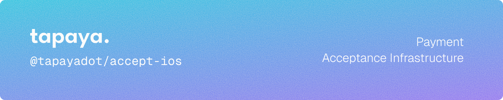

  [](https://docs.tapaya.com) [](LICENSE) 

iOS SDK for integrating Tapaya Accept payment processing into your app.

## Installation

### Swift Package Manager

Add via Xcode: **File → Add Package Dependencies** and enter:

```
https://github.com/tapayadot/accept-ios.git
```

Or add to your `Package.swift`:

```swift
dependencies: [
    .package(url: "https://github.com/tapayadot/accept-ios.git", from: "1.0.0")
]
```

## Usage

### Setup

```swift
import AcceptSDK

// Initialize (call once at app launch)
try await Accept.initialize(demo: isTestMode)

// Authenticate with your merchant token
try await Accept.authenticate(merchantToken: "your-merchant-token")
```

### Card Payment

```swift
let outcome = try await Accept.pay(AcceptCardPaymentIntent(
    amount: 1000,
    requestedCurrency: .eur,
    settlementCurrency: .eur
))

switch outcome {
case .completed(let status):
    print("Payment completed: \(status.paymentToken)")
case .canceled:
    print("Payment canceled")
}
```

### SEPA Instant Credit Transfer

```swift
let outcome = try await Accept.pay(AcceptSepaPaymentIntent(
    amount: 1000,
    requestedCurrency: .eur,
    settlementCurrency: .eur
))

switch outcome {
case .completed(let status):
    print("Payment completed: \(status.paymentToken)")
case .canceled:
    print("Payment canceled")
}
```

### Certis (Czech Instant Transfer)

```swift
let outcome = try await Accept.pay(AcceptCertisPaymentIntent(
    amount: 10000,
    requestedCurrency: .czk,
    settlementCurrency: .czk
))

switch outcome {
case .completed(let status):
    print("Payment completed: \(status.paymentToken)")
case .canceled:
    print("Payment canceled")
}
```

### KYB Onboarding

```swift
let result = try await Accept.presentKyb(prefilling: KybPrefillData(
    businessType: .soleTrader,
    countryCode: "DE",
    legalName: "Acme GmbH",
    businessEmail: "hello@acme.de"
))

switch result {
case .submitted:
    print("KYB submitted")
case .cancelled:
    print("User cancelled")
case .failed:
    print("Onboarding failed")
}
```

## Documentation

Full documentation is available at [docs.tapaya.com](https://docs.tapaya.com).

## License

Licensed under the [Apache License, Version 2.0](LICENSE).
